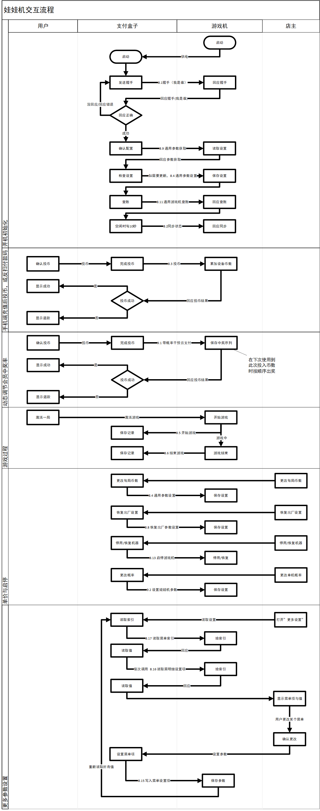
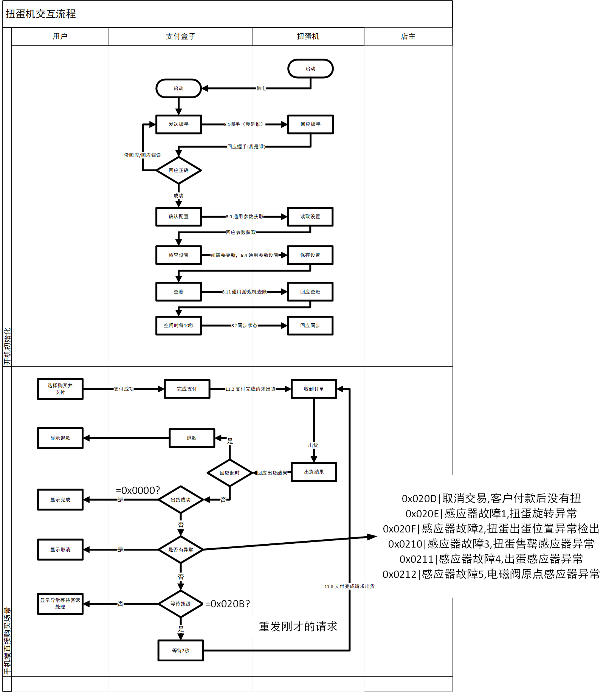
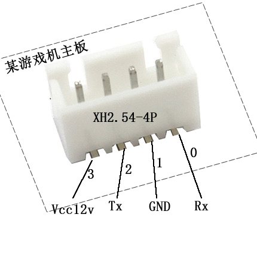
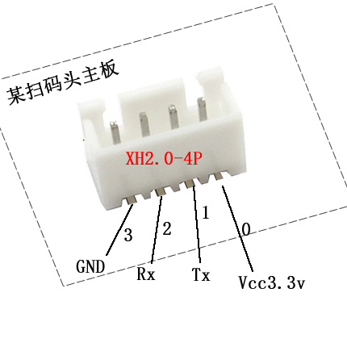

# 游戏机通用扩展协议


CNGPI(China Gaming devices Public Interface)

此logo用于标记自己产品已支持此协议， [矢量图下载](https://github.com/xsharkx/CNGPI/raw/master/logo/CNGPIV1.ai)

PC版调试工具(V1.18) 

[支付盒子模拟器](https://github.com/xsharkx/CNGPI/raw/master/Tools/CNGPI_PayBoxV1.18.zip)

[娃娃机模拟器](https://github.com/xsharkx/CNGPI/raw/master/Tools/CNGPI_GameMachineV1.18.zip)

[口红机模拟器](https://github.com/xsharkx/CNGPI/raw/master/Tools/CNGPI_VendingV1.18.zip)

## 一 摘要
本文档定义出游戏机与周边设备互动的通讯协议，包括如下用途：
- 游戏机与卡系统进行支付与数据采集
- 游戏机与投币器进行投币防干扰
- 游戏机与数据采集设备进行数据交换与监控

游戏机行业有史以来一直没有一份受大家公认的协议，虽存在两两厂商互通。但存在不通用不完善的缺点。导致浪费各方资源。由此诞生此协议，此协议定义的主要目的如下：
- 统一游戏机周边对接设备的协议，减少行业资源浪费
- 使用协议通讯放弃脉冲通讯，提高游戏机安全性（防止干扰器）
- 实现游戏机与各设备即插即用，减去安装调试步骤，降低最终用户使用门槛
- 实现游戏机信息采集与控制
- 同步游戏过程提升用户体验
- 提升通讯可靠性让对接更严谨高效

## 二 协议线路愿景
- V1.0 覆盖主流的纯玩机，彩票机，礼品机与周边设备的通讯协议
- V1.1 召集各厂商（20家）加入实现此协议并邀请各厂商技术工程师加入维护团队
- V1.5 协议已完善并初步稳定，并倡导厂商贡献出实现接口的代码
- V2.0 生产出协议调试设备，以及多P位Hub设备方便调试使用。

欢迎行业各位大神加入到此协议的完善与优化，有意加入维护的行业技术人员可通过自行Fork代码提交自己的更新。或者微信联系 13025128215 杨生进行接口优化探讨。另外如有疑问也可在Github里进行探讨。https://github.com/xsharkx/CNGPI

也希望广大厂商加入此项目将自己的产品录入进来，或者联系杨生进行登记，登记需要如下信息：厂商名，产品名，产品内部编码，产品图片（正面照一张800X600像素，侧45度一张800X600像素）,长，宽，高（cm），设备类型（纯玩机,彩票机,娃娃机,扭蛋机，口红机,福袋机）

## 三 重要内容索引

### 3.1 指令索引

[五 名词解释](#P5)

[六 电器物理特性](#P6)

[七 数据包基础规则](#P7)

[八 通用命令部分](#P8)

- [8.1 握手](#P8_1)
- [8.2 状态同步](#P8_2)
- [8.3 投币](#P8_3)
- [8.4 通用参数设置](#P8_4)
- [8.5 开始游戏](#P8_5)
- [8.6 结束游戏](#P8_6)
- [8.8 恢复出厂参数设置](#P8_8)
- [8.9 通用参数获取](#P8_9)
- [8.11 通用游戏机查账](#P8_11)
- [8.12 游戏机报警](#P8_12)
- [8.13 启停游戏机](#P8_13)
- [8.15 写入菜单设置项](#P8_15)
- [8.16 读取菜明细设置项](#P8_16)
- [8.17 读取菜单索引](#P8_17)

[九 娃娃机专用部分](#P9)

- [9.1 带概率干预云支付](#P9_1)
- [9.2 设置娃娃机参数](#P9_2)
- [9.3 娃娃机参数获取](#P9_3)

[十 彩票机专用部分](#P10)

- [10.1 设置彩票机参数](#P10_1)
- [10.2 读取彩票机参数](#P10_2)

[十一 售货机专用部分](#P10)

- [11.1 发起购买](#P11_1)
- [11.2 取消购买](#P11_2)
- [11.3 支付完成请求出货](#P11_3)
- [11.4 出货结果](#P11_4)


[十二 厂商以及产品名录](#P11)

[十三 设备故障码](#P12)

### 3.2 纯玩机交互流程


### 3.3 彩票机交互流程


### 3.4 娃娃机交互流程



### 3.5 扭蛋机交互流程



### 3.7 口红机交互流程


## 四 历史版本

**当前版本:109,代表v1.0，在握手时如适配此版本应在版本参数给100**

版本|日期|修改者|内容
---|---|---|---
V0.8|20180509|wangjianyi|初稿
V0.9|20180601|Benny|加入礼品机投币含中奖结果
V1.0|20180909|Benny|加入彩票机支持
V1.09|20180929|Benny|加入游戏售货机支持（口红机）
V1.12|20181022|Benny|调整售货机接口，加入各种机器运行流程图
V1.14|20181023|Benny|添加菜单设置接口，废弃扩展参数设置
V1.16|20181031|Benny|添加菜单设置接口，修改握手接口
V1.18|20181120|Benny|添加菜单索引获取接口,考虑116版本的设计需要厂商在后台进行菜单维护并且需要匹配对应版本,因此将菜单流程进行优化尽量避免出错减少运维操作复杂度

<A NAME="P5"></A>

## 五 名词解释
- 纯玩机:游戏过程中只投币无任何奖励的游戏设备
- 彩票机:游戏过程以彩票为主要奖励方式的游戏设备
- 扭蛋机:直接以金额购买扭蛋（内含玩具）的机机器
- 礼品机:游戏过程以实物礼品为主要奖励方式的游戏设备
- 娃娃机：这里单只使用一种或一类等价值礼品作为奖品的礼品机，大多数情况下奖品是毛绒公仔
- 实物币：传统场所用钱购买的的实际能拿在手里的一枚一枚代币
- 售货机:纯粹用金钱换物品的自助设备，一搬有多个储物格，典型的如扭蛋机
- 口红机：一搬有多个储物格，既能游戏获得又能直接购买
- 电子币：保存在某媒介的，不能实际拿到手上的虚拟代币
- 抓力:娃娃机在游戏某个阶段给予爪子的力度
- 卡头:通常安装在游戏机表面，带明显的显示装置，解决会员刷卡或线上支付的设备
- 支付盒子:通常安装在游戏机内部，作为游戏机扩展功能实现游戏的支付的设备
- 正扫：游戏机为了方便支付，将固定二维码贴在机器上。客户扫码都经过指引进行支付的一种支付形式
- 会员反扫：会员在手机出示虚拟会员卡的二维码，进行代币支付的一种支付形式
- 付款码反扫：会员在手机出示微信或支付宝付款吗，被游戏机扫描后进行支付的一种支付形式
- 扫码头：单纯实现将二维码或条码扫描到后将结果通过接口传递出去的设备，一般内嵌到设备中
- 事务ID：用于防止重发与漏发用的一个循环使用的ID，游戏机与外接设备自行维护每次使用后加一，溢出归零后继续循环，如接收到的事务ID与上次相同，视为已经处理过，回应成功。如果收到的事务ID不等于上次收到的事务ID表示需要进行处理和回应并将最新的ID记录起来。事务ID的累加由发送方控制，如两方都需要发送，那么两方需要各自保存发送的事务ID和接收的事务ID，此两个ID是没有必然关系的，编写程序时别弄反。并且在第一次使用时发送方需要使用1.这样不会因初始化都是0时认为重发了

```
        // 得到下次事务ID
        private int GetNextTransID()
        {
            LastSendTransID++;
            if(LastReciveTransID > 0xffff)
            {
                LastSendTransID = 0;
            }
            return LastSendTransID;
        }

        // 判断是否接收过
        private bool IsNewTransID(int transID)
        {
            return LastReciveTransID != transID;
        }        
```

- 厂商标识：标记各生产厂商的序号
- 产品标识：厂商出厂的某型号产品序号

<A NAME="P6" ></A>

## 六 电器物理特性

<A NAME="P6_1" ></A>

###  6.1 游戏机主板上固定接口定义（待完善）

使用XH2.54-4P封装插座如下图：如主板已经固化可做转接线进行对接



针脚定义如下：

脚位|定义|作用
---|---|---
0|Rx|串口接收TTL3.3v，建议对接的设备（盒子等）使用二极管隔离以防不慎将线插反导致损坏
1|GND|共地
2|Tx|串口发送TTL3.3v
3|Vcc|给对接的设备（盒子等）供电电压12v,电流200mA

串口通讯规则如下：
- 电平：TTL3.3v
- 波特率：38400
- 起始位：1位
- 数据位：8位
- 奇偶校验位：无
- 停止位：1位

<A NAME="P6_2" ></A>

### 6.2 游戏机内置扫码头接口定义（待完善）

使用XH2.0-4P封装插座如下图：



针脚定义如下：

脚位|定义|作用
---|---|---
0|Vcc|给扫码头供电3.3v,500mA
1|Tx|串口发送TTL3.3v
2|Rx|串口接收TTL3.3v
3|GND|共地

串口通讯规则如下：
- 电平：TTL3.3v
- 波特率：9600
- 起始位：1位
- 数据位：8位
- 奇偶校验位：无
- 停止位：1位
- 扫码头传输协议使用字节将内容使用AscII码进行编码传输，

<A NAME="P6_3" ></A>

### 6.3单主板单接口多P位说明
hub工作方式待讨论补充

<A NAME="P7" ></A>

## 七 数据包基础规则

###  7.1 所有数据通讯包包含如下元素:
名称|符号|长度|说明
---|---|---|---
包头|START|2字节|固定为0xEF37
地址|ADR|2字节|P位或设备地址,于用适应一个设备多个P位场景，0=广播，1=1P，2=2P
命令码|PID|2字节|指令码，用于判断DATA段的内容
内容长度|LEN|2字节|DATA段的数据长度
内容|DATA|N字节|命令的详细参数内容
校验|CHK|2字节|第一字节等于之前所有字节相加自动溢出既sum(START,...,DATA),第二字节等于之前所有字节异或既Xor(START,...,DATA)
包尾|END|2字节|固定为0XFE73

两个数据帧之间间隔至少6ms,指令未说明超时时间时默认已500ms作为超时时间

举例握手协议命令如下(Hex)：

START|ADR|PID|LEN|DATA|CHK|END
---|---|---|---|---|---|---
EF37|0000|0301|001F|00000001 00000001 FA00FCCDA57D8990FA00FCCDA57D8990 0101|4849|FE73

其中 

0x48=sum(EF3700000301001F0000000100000001FA00FCCDA57D8990FA00FCCDA57D89900101)

0x49=xor(EF3700000301001F0000000100000001FA00FCCDA57D8990FA00FCCDA57D89900101)

###  7.2 字节数组与数字转换

数据中如有多字节转换为数字时，高位在前，如 0x1234=0x12*256+0x34

###  7.3 基本原理

游戏机启动时，给外接设备供电。外接设备发送握手指令给游戏机，游戏机告知外接设备设备的厂商，使用的本协议的版本，和产品型号信息。外接设备根据接口版本自行兼容新旧协议版本。

<A NAME="P8"></A>

## 八 通用命令部分

此部分命令所有种类游戏机都必须实现

<A NAME="P8_1"></A>

### **8.1 握手(PID=0x0101)**
---

数据方向:外接设备->游戏机

说明：外接设备搜索游戏机，此时如果如果收不到游戏机的回应将会间隔500ms进行搜索，推荐如果1分钟内仍然搜索不到则每3秒一次进行搜索，直到连接成功。否则当离线处理.为让游戏机厂商开发便利，版本兼容由外接设备自动适配，游戏机只需实现某一版本协议即可，因此外接设备需要及时更新自身所兼容的协议版本。否则可能造成版本不兼容。

版本数字处理为百位以内是非结构性改动可。既如果两个版本数除以100如果相等既代表是天然兼容的，如果不相同则代表需要做兼容代码修改，举例：
100（v1.00）与104（v1.04），145（v1.45），189（v1.89）只是规则微调不影响参数的意义和内容，如果是104（v1.04）与205(v2.05)则是有新的指令加入或指令的参数意义有变化的。因此不兼容，需要修改代码适配。

发送设备在握手时，基础协议总的P位为设置为0，握手成功时需要将两方设备的事务ID设置成0

外接设备发送内容（DATA）如下:

发送参数|长度|说明
---|---|---
产品标识|4Byte|产品编号，第十二章名录，前两字节是厂商标识
设备唯一ID|16Byte|相对厂商和产品唯一ID
设备类型|2Byte|0x0101=卡头,0x0102=投币器,0x0103=支付盒子，0x0104出票器

游戏机回应PID=0x0181内容如下:

应答参数|长度|说明
---|---|---
协议版本|4Byte|当前使用的本协议版本如：118，100=V1.0，101=V1.01.需要外接设备根据此数来适配不同版本的协议，当前版本说明一般注明在文档第四章
产品标识|4Byte|产品编号，第十二章名录，如0x00010001，用于标识某个厂商的某个产品
设备唯一ID|16Byte|用于区分每一台设备，厂商需要保证唯一
总P位数|1Byte|此游戏机总共P位数，售货机为售货格子数
当前P位|1Byte|此物理接口控制的P位序号，0=此接口控制所有P位，1=只控制1P，2=2P，3=3P...
设备类型|2Byte|0x0001=纯玩机,0x0002=彩票机,0x0003=娃娃机,0x0004=扭蛋机，0x0005=口红机,0x0006=福袋机
游戏机软件版本|2Byte|游戏机软件版本,用于查看版本,菜单设置时的版本控制,协议版本大于等于116时才生效

举例：待完善

<A NAME="P8_2"></A>

### **8.2 状态同步(PID=0x0102)**
---

数据方向:外接设备->游戏机

说明：用于外接设备与游戏机进行状态同步，外接设备在空闲时每隔10秒发一次同步, 游戏中每隔1秒，游戏机可以此响应作为外接设备是否在线的依据，超时时间500ms

外接设备发送内容（DATA）如下:

发送参数|长度|说明
---|---|---
设备状态|2Byte|0x0000=正常，其他=故障码，详见第十三章故障码

游戏机回应（PID=0x0182）内容如下:

应答参数|长度|说明
---|---|---
游戏机状态|1Byte|0x00=游戏机启动中,0x01=待机状态,0x02=有币待开始,0x03=游戏中,0x04=游戏结束(3秒后转为待机或有币待开始)，0x05=进入了设置模式，0x06=故障中，0x07=被停用状态（见8.13）
剩余游戏币数|2Byte|游戏机内剩余未使用币数	
预计游戏结束时间|2Byte|单位为秒，状态为游戏中有效
故障码|2Byte|故障中状态有效，详见第十三章故障码

举例：待完善

<A NAME="P8_3"></A>

### **8.3 投币(PID=0x0103)**
---

数据方向:外接设备->游戏机

说明：此场景用于，外接设备进行云支付或者投币器进行投币时使用，当用于礼品机时表示此次投币使用游戏机内置单机概率进行出奖,将以每500ms一次的频率一直发送5秒直到有回应，如5秒未回应代表离线将按超时来处理。支付设备将进行退款处理。

外接设备发送内容（DATA）如下:

发送参数|长度|说明
---|---|---
事务ID|2Byte|用于标识一次投币行为的防重发与防漏发
投币数|2Byte|投币数量
币类型|1Byte|0=电子币,1=实物币

游戏机回应PID=0x0183内容如下:

应答参数|长度|说明
---|---|---
此次事务ID|2Byte|复制发送的事务ID
结果|2Byte|0x0000=成功,其他=错误码，详见第十三章故障码

举例：待完善

<A NAME="P8_4"></A>

### **8.4 通用参数设置(PID=0x0104)**
---

数据方向:外接设备->游戏机

说明：用于远程设置游戏机参数，将纯玩机参数设置到机器中，超时时间2秒

外接设备发送内容（DATA）如下:

发送参数|长度|说明
---|---|---
每局币数|1Byte|0~255（枚）


游戏机回应PID=0x0184内容如下:

应答参数|长度|说明
---|---|---
结果|2Byte|0x0000=成功,其他=错误码，详见第十三章故障码

举例：待完善

<A NAME="P8_5"></A>

### **8.5 开始游戏(PID=0x0105)**
---

数据方向:游戏机->外接设备

说明：用于游戏机开始时通知外接设备状态，给用户交互带来更流畅体验,间隔500ms发送10次，10次都未回应放弃通知。任意一次收到回应即可完成。

游戏机发送内容（DATA）如下:

发送参数|长度|说明
---|---|---
事务ID|2Byte|见名词解释事务ID

外接设备回应PID=0x0185内容如下:

应答参数|长度|说明
---|---|---
事务ID|2Byte|见名词解释事务ID

举例：待完善

<A NAME="P8_6"></A>

### **8.6 结束游戏(PID=0x0106)**
---

数据方向:游戏机->外接设备

说明：用于游戏机结束游戏时。将游戏结果反馈给其他外接设备。如连接正常但无响应时，此指令需要与投币指令一样将以每500ms一次的频率发送10次直到有回应，如10次未回应代表离线将按超时来处理。建议游戏机将此信息保存起来下次继续执行并在游戏交互界面提示错误与重试。

游戏机发送内容（DATA）如下:

发送参数|长度|说明
---|---|---
事务ID|2Byte|见名词解释事务ID
出奖数量|4Byte|0~0xFFFFFFFF 出奖数量，不中奖=0
奖品类型|1Byte|0=游戏得分，1=彩票，2=实物奖品
奖品出口|1Byte|一般用于多礼品机，默认=0。售货机为箱子号

外接设备回应PID=0x0186内容如下:

应答参数|长度|说明
---|---|---
此次事务ID|2Byte|复制发送的事务ID
结果|2Byte|0x0000=成功,其他=错误码，详见第十三章故障码

举例：待完善

<A NAME="P8_7"></A>

### **8.7 设置游戏机扩展参数(PID=0x0107) <font color=red>v1.12后弃用</font>**
---

数据方向:外接设备->游戏机

说明：用于将非高频设置的参数进行同款游戏机复制使用。通过某台机器手动线下设置后。通过软件界面读取后批量设置到同款产品，这样可以节省重复设置的时间。设置内容由厂商自定义。扩展参数如灯光选择，音乐选择，各种爪力电压等等，默认超时2秒

外接设备发送内容（DATA）如下:

发送参数|长度|说明
---|---|---
其他参数|nByte|厂商自定义内容，用于同款产品非高频设置复制

游戏机回应PID=0x0187内容如下:

应答参数|长度|说明
---|---|---
结果|2Byte|0x0000=成功,其他=错误码，详见第十三章故障码

举例：待完善

<A NAME="P8_8"></A>

### **8.8 恢复出厂参数设置(PID=0x0108)**
---

数据方向:外接设备->游戏机

说明：用于远程设置游戏机参数，将游戏机设置还原成出厂默认参数，超时时间2秒

外接设备发送内容（DATA）如下:

发送参数|长度|说明
---|---|---
无| | 

游戏机回应PID=0x0188内容如下:

应答参数|长度|说明
---|---|---
结果|2Byte|0x0000=成功,其他=错误码，详见第十三章故障码

举例：待完善

<A NAME="P8_9"></A>

### **8.9 通用参数获取(PID=0x0109)**
---

数据方向:外接设备->游戏机

说明：用于外接设备读取游戏机的通用参数，默认超时2秒

外接设备发送内容（DATA）如下:

发送参数|长度|说明
---|---|---
无||

游戏机回应PID=0x0189内容如下:

应答参数|长度|说明
---|---|---
故障码|2Byte|如出现故障此处非0，详见第十三章故障码，如填写故障码其他参数无效
每局币数|1Byte|0~255（枚）

举例：待完善

<A NAME="P8_10"></A>

### **8.10 游戏机扩展参数获取(PID=0x010A)  <font color=red>v1.12后弃用</font>**
---

数据方向:外接设备->游戏机

说明：用于外接设备读取游戏机的通用参数，默认超时2秒

外接设备发送内容（DATA）如下:

发送参数|长度|说明
---|---|---
无||

游戏机回应PID=0x018A内容如下:

应答参数|长度|说明
---|---|---
故障码|2Byte|如出现故障此处非0，详见第十三章故障码，如填写故障码其他参数无效
其他参数|nByte|厂商自定义内容，用于同款产品非高频设置复制

举例：待完善

<A NAME="P8_11"></A>

### **8.11 通用游戏机查账(PID=0x010B)**
---

数据方向:外接设备->游戏机

说明：用于外接设备读取游戏机电子码表数据，默认超时2秒

外接设备发送内容（DATA）如下:

发送参数|长度|说明
---|---|---
无||

游戏机回应PID=0x018B内容如下:

应答参数|长度|说明
---|---|---
故障码|2Byte|如出现故障此处非0，详见第十三章故障码，如填写故障码其他参数无效
实物币数量|4Byte|历史以来实物币投币量
电子币数量|4Byte|历史以来电子币投币量
掉落礼品数量|4Byte|历史掉落礼品数量
出票数量|4Byte|历史出彩票数量

举例：待完善

<A NAME="P8_12"></A>

### **8.12 游戏机报警(PID=0x010C)**
---

数据方向:游戏机->外接设备

说明：用于游戏机出现作弊行为通知外接设备，每500ms一次的频率发送10次直到有回应

游戏机发送内容（DATA）如下:

发送参数|长度|说明
---|---|---
事务ID|2Byte|事务ID
报警类型|1Byte|0=物理摇晃,1=检测到干扰器干扰

外接设备回应PID=0x018C内容如下:

应答参数|长度|说明
---|---|---
事务ID|2Byte|事务ID

举例：待完善

<A NAME="P8_13"></A>

### **8.13 启停游戏机(PID=0x010D)**
---

数据方向:游戏机->外接设备

说明：用于外接设备在检测到异常（干扰）或故障率偏高或被设置为停用时让游戏机不能工作，直到被此指令恢复，如游戏机能控制投币器投币可禁用投币器使其不接受投实物币，默认超时2秒

游戏机发送内容（DATA）如下:

发送参数|长度|说明
---|---|---
事务ID|2Byte|事务ID
动作|1Byte|0=停用,1=恢复

外接设备回应PID=0x018D内容如下:

应答参数|长度|说明
---|---|---
事务ID|2Byte|事务ID

举例：待完善

<A NAME="P8_14"></A>

### **8.14 读取菜单设置项(PID=0x010E) <font color=red>v1.18后弃用</font>**
---

数据方向:外接设备->游戏机

说明：用于外接设备读取非通用参数的设置，用于手机远程设置参数,菜单编号由游戏机厂家在手机系统后台添加,当需要设置时,会读取所有设置到手机,手机设置完后一次设置到游戏机.
<font color=red>此菜单项因需要在后台配置才能使用,维护复杂,因此v1.18后弃用,使用8.16和8.17替代</font>

<A NAME="P8_15"></A>

### **8.15 写入菜单设置项(PID=0x010F)**
---

数据方向:外接设备->游戏机

说明：用于外接设备写入非通用参数的设置，用于手机远程设置参数

游戏机发送内容（DATA）如下:

发送参数|长度|说明
---|---|---
菜单设置项编号|2Byte|要写入的编号
菜单设置项值|4Byte|值

外接设备回应PID=0x018F内容如下:

应答参数|长度|说明
---|---|---
故障码|2Byte|如出现故障此处非0，详见第十三章故障码

举例：待完善

<A NAME="P8_16"></A>

### **8.16 读取菜明细设置项(PID=0x0110)**
---

数据方向:外接设备->游戏机

说明：用于外接设备读取游戏机高级配置时使用

游戏机发送内容（DATA）如下:

发送参数|长度|说明
---|---|---
菜单项编号|2Byte|要读取的菜单项编号

游戏机回应PID=0x0190内容如下:

应答参数|长度|说明
---|---|---
故障码|2Byte|如出现故障此处非0，详见第十三章故障码
菜单项编号|2Byte|要读取的编号
菜单项值|4Byte|值,正整数
可填最大值|4Byte|最大值,正整数
可填最小值|4Byte|最小值,正整数
菜单项名称|32Byte|菜单项名字,使用UniCode编码的文字,0表示结束
菜单项说明长度|1Byte|菜单项说明占用字节长度,不能超过200
菜单项说明|nByte|使用UniCode编码的文字

举例：待完善

<A NAME="P8_17"></A>

### **8.17 读取菜单索引(PID=0x0111)**
---

数据方向:外接设备->游戏机

说明：用于远程菜单设置时读取游戏机可设置的菜单项,所有菜单项不能超过100个,否则视为无效

游戏机发送内容（DATA）如下:

发送参数|长度|说明
---|---|---
无||

游戏机回应PID=0x0191内容如下:

应答参数|长度|说明
---|---|---
故障码|2Byte|如出现故障此处非0，详见第十三章故障码
总共菜单项数量|1Byte|要读取的编号总数
菜单设置编号|nByte|可变长度,根据总共菜单项数量*2,每两个字节为一个可读取菜单项编号

举例：待完善

<A NAME="P9"></A>


## 九 娃娃机专用部分，其他类型可忽略

此部分内容娃娃机必须实现

<A NAME="P9_1"></A>

### **9.1 带概率干预云支付(PID=0x0201)**
---

数据方向:外接设备->游戏机

说明：此场景用于礼品机支付时云端服务对其进行概率干预时使用，超时处理同8.2，游戏机记录此投币码表时都计算成电子币，每500ms一次的频率发送10次直到有回应，无回应会退款，一次局数不要超过99，以免游戏机存储空间不足

外接设备发送内容（DATA）如下:

发送参数|长度|说明
---|---|---
事务ID|2Byte|见名词解释
游戏局数|1Byte|此处非游戏币数，是游戏能开始的次数,并且小于100
中奖序列|游戏局数*1Byte|0x00=不出奖(娃娃机),0x01=出奖（娃娃机）,0x02=不确定,中奖难度低（口红机），0x03=不确定,中奖难度中（口红机），0x04=不确定,中奖难度高（口红机），此次增加局数按此序列进行出奖


游戏机回应PID=0x0281内容如下:

应答参数|长度|说明
---|---|---
此次事务ID|2Byte|复制发送的事务ID
支付结果|2Byte|0x0000=成功,其他=错误码，详见第十三章故障码

举例：待完善

<A NAME="P9_2"></A>

### **9.2 设置娃娃机参数(PID=0x0202)**
---

数据方向:外接设备->游戏机

说明：用于远程设置礼品机参数，其中强爪力度一般会给100，如果非100是为了让强爪和弱爪不那么明显的差距。弱爪力度一般是根据娃娃的重量来估算力度的。如果需要对力度进行精准的第一，第二，第三爪力进行调节，请在机器上进行手动调节后，娃娃机根据弱爪力度整体控制。如需解决复杂爪力设置后复制到其他设备问题，请使用8.8章的扩展参数进行读取和设置进行复制。默认超时2秒

外接设备发送内容（DATA）如下:

发送参数|长度|说明
---|---|---
每局币数|1Byte|0~255（枚）
游戏时间|1Byte|1~255（秒）
弱爪力度|1Byte|1~100 (百分比)
强爪力度|1Byte|1~100 (百分比)
单机中奖率-币数|2Byte|0~0xFFFF几币出奖
单机中奖率-出奖数|2Byte|0~0xFFFF出奖数量，与上一个参数结合后既x币会中y次奖,用于在非服务端进行概率干预时游戏机自行处理中奖判断

游戏机回应PID=0x0282内容如下:

应答参数|长度|说明
---|---|---
结果|2Byte|0x0000=成功,其他=错误码，详见第十三章故障码

举例：待完善

<A NAME="P9_3"></A>

### **9.3 娃娃机参数获取(PID=0x0203)**
---

数据方向:外接设备->游戏机

说明：用于外接设备读取娃娃机参数，默认超时2秒

外接设备发送内容（DATA）如下:

发送参数|长度|说明
---|---|---
无||

游戏机回应PID=0x0283内容如下:

应答参数|长度|说明
---|---|---
故障码|2Byte|如出现故障此处非0，详见第十三章故障码，如填写故障码其他参数无效
每局币数|1Byte|0~255（枚）
游戏时间|1Byte|1~255（秒）
弱爪力度|1Byte|1~100 (百分比)
强爪力度|1Byte|1~100 (百分比)
单机中奖率-币数|2Byte|0~0xFFFF几币出奖
单机中奖率-出奖数|2Byte|0~0xFFFF出奖数量，与上一个参数结合后既x币会中y次奖,用于在非服务端进行概率干预时游戏机自行处理中奖判断

举例：待完善

<A NAME="P10"></A>

## 十 彩票机专用部分

此部分内容彩票机必须实现

<A NAME="P10_1"></A>

### **10.1 设置彩票机参数(PID=0x0301)**
---

数据方向:外接设备->游戏机

说明：用于设置彩票类设备的游戏机重要参数，默认超时2秒

外接设备发送内容（DATA）如下:

发送参数|长度|说明
---|---|---
每局币数|1Byte|0~255（枚）
返奖率-币数|2Byte|0~65535(个)
返奖率-票数|2Byte|0~65535（票）与上一个参数合起来概率变为每xx币返奖xx票

游戏机回应PID=0x0381内容如下:

应答参数|长度|说明
---|---|---
结果|2Byte|0x0000=成功,其他=错误码，详见第十三章故障码

举例：待完善

<A NAME="P10_2"></A>

### **10.2 读取彩票机参数(PID=0x0302)**
---

数据方向:外接设备->游戏机

说明：用于读取彩票机参数，默认超时2秒

外接设备发送内容（DATA）如下:

发送参数|长度|说明
---|---|---
无||

游戏机回应PID=0x0382内容如下:

应答参数|长度|说明
---|---|---
故障码|2Byte|如出现故障此处非0，详见第十三章故障码，如填写故障码其他参数无效
每局币数|1Byte|0~255（枚）
返奖率-币数|2Byte|0~65535(个)
返奖率-票数|2Byte|0~65535（票）与上一个参数合起来概率变为每xx币返奖xx票

举例：待完善

<A NAME="P11"></A>

## 十一 售货机专用部分

此部分内容售货机和游戏售货机需要实现

<A NAME="P11_1"></A>

### **11.1 发起购买(PID=0x0401)**
---

数据方向:游戏机->外接设备

说明：用于在售货机屏幕选定商品后进行支付的场景，默认超时5秒，3次重试，如果超时请发送取消购买指令，应答的二维码内容用于正扫的显示,如发送的订单号与
上次相同表示超时时间加长了.需要重新计时

游戏机发送内容（DATA）如下:

发送参数|长度|说明
---|---|---
格子号|2Byte|售货机格子编号，0开始。管理系统已知每个各自的商品
价格|4Byte|单位（分）商品售卖价格
订单号|16Byte|订单唯一序号，游戏机自行生成保证当天本机唯一，用于防止重复下单
超时时间|1Byte|单位秒，如超过此时间未支付将自动取消交易

设备回应PID=0x0481内容如下:

应答参数|长度|说明
---|---|---
错误码|2Byte|如出现故障此处非0，详见第十三章故障码，如填写故障码其他参数无效
二维码内容|150Byte|二维码的URL，用于生成二维码，0=结束

<A NAME="P11_2"></A>

### **11.2 取消购买(PID=0x0402)**
---

数据方向:游戏机->外接设备

说明：用于在售货机屏幕选择取消支付时通知外接设备。有可能取消的时候已经支付成功了，将会继续将购物流程走下去。如果取消的时候还未完成将取消支付。

游戏机发送内容（DATA）如下:

发送参数|长度|说明
---|---|---
事务ID|2Byte|见名词解释
订单号|16Byte|订单唯一序号，游戏机自行生成保证当天本机唯一，用于防止重复下单

设备回应PID=0x0482内容如下:

应答参数|长度|说明
---|---|---
事务ID|2Byte|见名词解释
错误码|2Byte|如出现故障此处非0，详见第十三章故障码，如填写故障码其他参数无效

<A NAME="P11_3"></A>

### **11.3 支付完成请求出货(PID=0x0403)**
---

数据方向:外接设备->游戏机

说明：设备通知游戏机出货，默认超时5秒，超时重试5次。收到后马上启动机械装置出货。出货结果需要回应,如出货不成功系统将会将此订单置疑,请求售后处理。如5次都没有响应将退款

设备发送内容（DATA）如下:

发送参数|长度|说明
---|---|---
事务ID|2Byte|见名词解释
订单号|16Byte|订单唯一序号，游戏机自行生成保证当天本机唯一，用于防止重复下单
格子号|2Byte|售货机格子编号，0开始。管理系统已知每个各自的商品
价格|4Byte|单位（分）商品售卖价格

游戏机回应PID=0x0483内容如下:

应答参数|长度|说明
---|---|---
错误码|2Byte|0x0000=成功,其他=错误码，详见第十三章故障码
事务ID|2Byte|见名词解释

<A NAME="P11_4"></A>

### **11.4 出货结果(保留，无需实现)**

<A NAME="P11_5"></A>

### **11.5 设置商品和价格(保留，无需实现)**

<A NAME="P11_6"></A>

### **11.6 更新库存(保留，无需实现)**

<A NAME="P11_7"></A>

### **11.7 设置时间(保留，无需实现)**

<A NAME="P11_8"></A>

### **11.8 补货开柜(保留，无需实现)** 

<A NAME="P11_9"></A>

### **11.9 获取游戏正扫二维码(PID=0x0409)**
---

数据方向:游戏机->外接设备

说明：用于游戏机在屏幕上出现友好的支付提示，超时2秒

游戏机发送内容（DATA）如下:

发送参数|长度|说明
---|---|---

外接设备回应PID=0x0489内容如下:

应答参数|长度|说明
---|---|---
错误码|2Byte|如出现故障此处非0，详见第十三章故障码，如填写故障码其他参数无效
二维码内容|150Byte|二维码的URL，用于生成二维码，0=结束

举例：待完善

<A NAME="P12"></A>

## 十二 厂商以及产品名录

---

厂商|厂商编号|产品|产品统一编号|设备类型|详情
---|---|---|---|---|---
油菜花|0001|芸苔盒子|0x00010001|支付盒子|[详情](Device/0001/00010001/README.md)
油菜花|0001|芸苔反扫卡头|0x00010002|卡头|[详情](Device/0001/00010001/README.md)
华熙动漫|0002|两爪机（双人）|0x00020001|娃娃机|[详情](Device/0002/00020001/README.md)
谷微动漫|0003|超级抓神|0x00030001|娃娃机|[详情](Device/0003/00030001/README.md)
中芯动漫|0004|口红挑战|0x00040001|口红机|蓝迪,火石[详情](Device/0004/00040001/README.md)
万代|0005|扭蛋机|0x00050001|扭蛋机| 
乐摇摇|0006|支付盒子|0x00060001|支付盒子| 
维码器|0007|支付盒子|0x00070001|支付盒子| 
科蝶|0008|支付盒子|0x00080001|支付盒子| 
龙盛达|0009|娃娃机套件|0x00090001|娃娃机|可酷像素娃娃机,可酷你好娃娃机
圣域软件|000A|恋恋红唇|0x000A0001|口红机|荣烁
爱怡航|000B|娃娃机|0x000B0001|娃娃机|
爱怡航|000B|口红机|0x000B0002|口红机|
爱怡航|000B|福袋机|0x000B0003|福袋机|
称心科技|000C|娃娃机套件|0x000C0001|娃娃机|
棒棒堂|000D|棒棒堂口红机|0x000D0001|口红机|

<A NAME="P13"></A>

## 十三 设备故障码

故障码0x0000代表无故障，其余分为游戏机故障和外接设备故障两种

游戏机故障码

代码|说明
---|---
0x0101|游戏机初始化异常
0x0102|投币器故障
0x0103|出票器故障
0x0201|天车左右运动故障
0x0202|天车前后运动故障
0x0203|天车上下运动故障
0x0204|等待天车移出超时
0x0205|启动收爪超时
0x0206|启动游戏超时
0x0207|启动抓物超时
0x0208|天车归位超时
0x0209|电子锁开启异常
0x020A|出货异常
0x020B|设备正忙,需要等待


外接设备故障码

代码|说明
---|---
0x0801|无法连接服务器
0x0802|无法连接网络
0x0803|账户异常不能支付
0x0804|未注册到商户
0x0805|刷卡部件异常
0x0806|设备正忙,需要等待
0x08FF|其他异常